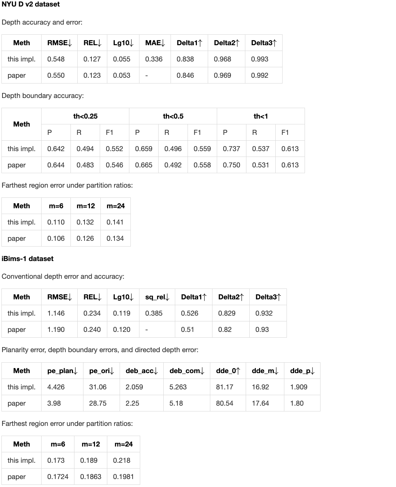

# Boundary-induced and scene-aggregated network for monocular depth prediction

Created by Junfeng Cao, Fei Sheng and Feng Xue.

### Introduction

Monocular depth prediction is an important task in scene understanding. It aims to predict the dense depth of a single RGB image.
Furthermore, it can be used for scene understanding and perception, such as object detection, segmentation, and 3D reconstruction.
Obtaining accurate depth information is a prerequisite for many computer vision tasks.

The Data Preparation and Evaluation are following Junjie Hu with [his work](https://github.com/JunjH/Revisiting_Single_Depth_Estimation).
Thanks for his valuable work.

### Citation

If you find BS-Net useful in your research, please consider citing:
```
@article{BSNet,
title = {Boundary-induced and scene-aggregated network for monocular depth prediction},
author = {Feng Xue and Junfeng Cao and Yu Zhou and Fei Sheng and Yankai Wang and Anlong Ming},
journal = {Pattern Recognition},
pages = {107901},
year = {2021}
}
```

## Dependencies
python 3.6  
Pytorch 1.0  
scipy 1.2.1  
h5py 3.0.0  
Pillow 6.0.0  
scikit-image 0.17.2  
scikit-learn 0.22.1

## Data Preparation

#### NYUD v2

You may download the dataset from [NYUD v2](https://drive.google.com/file/d/1WoOZOBpOWfmwe7bknWS5PMUCLBPFKTOw/view?usp=sharing) and unzip it to the ./data folder. You will have the following directory structure:
```
BS-Net
|_ data
|   |-nyu2_train
|   |-nyu2_test
|   |-nyu2_train.csv
|   |-nyu2_test.csv
```

#### iBims-1

For iBims-1  dataset only have 100 RGB-D pictures especially designed for testing single-image depth estimation methods, you may download the dataset original images from [iBims-1](https://www.bgu.tum.de/lmf/ibims1/) . And you will have the following directory structure:
```
BS-Net
|_ data
|  |_ iBims1
|     |_ ibims1_core_raw
|     |_ ibims1_core_mat
|     |_ imagelist.txt
```
## Training

For training BS-Net on NYUD v2 training dataset, you can run:

```
python train.py
```
You can download our trained model from [Google Drive](https://drive.google.com/file/d/1r-xjxP-Ds5inGKRFHK9JX7VoplcFYiRH/view?usp=sharing) or [Baidu Netdisk](https://pan.baidu.com/s/1WifbKL2_KQ11H1nsYrG3yw) (Code: 1jmz).

Note that: the performance of the given model is slightly different from the manuscript, which is represented as follows. And  means smaller is better, and  means larger is better.



## Evaluation

For testing BS-Net on NYUD v2 testing dataset, you can run:
```
python test.py
```
or testing on iBims-1  dataset you can run:
```
python test_iBims1.py
```
